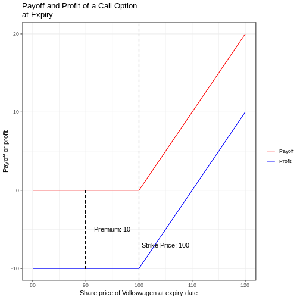
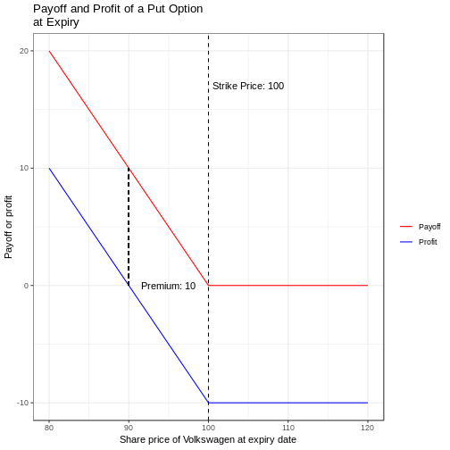
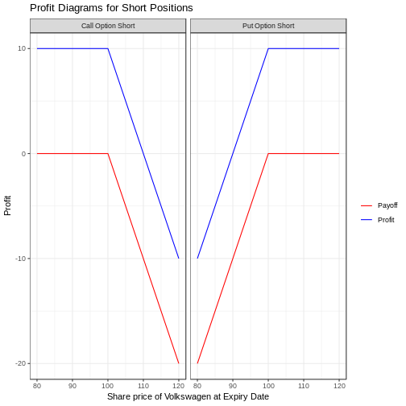
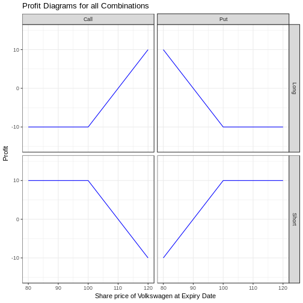

An option gives the buyer the right (but not the obligation) to buy or sell an (underlying) asset at a given (expiry) date, for a given (strike) price.

There are two types of basic options "call" and "put" options, which can be bought (long-position) or sold (short-position). 

A call option is a derivative that allows the buyer (of the option) to buy, whereas the put option allows the buyer of the option to sell the underlying asset (the underlying asset can be a stock, a commodity, or any other asset-class). 

Each option has multiple metrices that we will go into, for now, we will only look at the very basic inputs, which are the ***Strike Price*** for which the underlying asset cann be bought or sold, the ***Expiry Date*** at which the exchange is executed, and lastly the ***Premium***, the price for which the option can be bought.

On a side note: The described option is a so called ***European Option*** (the expiry date is only a single date), however, there are multiple other forms of options, the most common alternative is the ***American Option***, where the option can be exercised at all times before or at the expiry date, furthermore, there is the ***Bermuda Option***, where the option can be exercised in some given time-spans (Bermuda as in the middle between Europe and America).

# Call Option

The following chart gives the payoffs and profits for a long position in a european call option (long = buyer of the option; european = only exercisable at expiry; call = gives the buyer the right to buy the underlying asset). The buyer gets the right to buy the underlying asset ( in this case the stock of Volkswagen) for a price of 100\$ (strike price) and pays 10\$ as a premium for the right (option). 

In the area where the stock price of Volkswagen (value of the underlying asset) is smaller than the strike price (x-values smaller than 100), the buyer of the option would not exercise the option, as she could buy the stock cheaper in the regular market (remember, the value is less than 100), therefore the payoff is 0\$ (that is also the value of the option at expiry), however, the profit is -10\$ (she had to pay the premium to get the option in the first place). For a share price above the premium the payoff would be the difference between the share price of Volkswagen and the strike price (given that the share price would be 110\$, she buys the share for the strike at 100\$ from the seller of the option and immediately sells the share at the stock for 110\$, making a payoff of 10\$, however, having paid 10\$ for the option, the payoff is 0\$).

More formally put, the payoff $PO$ of the option at expiry, for a long position in a call option with a strike price of $K$ for a range of values of the underlying asset $S_T$ at expiry, is given by

$$PO_{Call} = max[0, S_T - K],$$

which is abbreviated to

$$PO_{Call} = (S_T - K) ^ +,$$

where $(x)^+$ is the equivalent to $max(x, 0)$, contrary $(x)^-$ equals $min(x, 0)$.

whereas the profit/loss $PL$ is subject to the premium, which is normally called $C$ for call-options and $P$ for put-options.

$$PL_{Call} = max[0, S_T - K] - C = max[- C, S_T - K - C] = (S_T - K) ^+ - C$$

# Put Option 

On the other hand, we have a put option, which gives the buyer of the option the right to sell the underlying asset. A long-position in a put option looks like this:

The payoff and profit of a put option are given by

$$PO_{Put} = min[0, S_T - K] = (S_T - K)^-$$

whereas the $PL$ is also subject to the premium ($P$ for put-options)

$$PL_{Put} = min[0, S_T - K] + P = min[P, S_T - K + P] = (S_T - K)^-  + P$$

# Short positions

The short-position is given by a trader who sells the given option to the buyer. The payoff is the exact opposite of the long-position. 

The payoffs for a short position in a call option is given by

$$PO_{Call, Short} = - max[0, S_T - K] = min[0, K - S_T] = (K-S_T)^-$$

with a profit-loss function of

$$PL_{Call, Short} = - max[0, S_T - K] + C = min[C, K - S_T + C] = (K-S_T)^- + C$$

and for the put option

$$ PO_{Put, Short} = - min[0, S_T - K] = max[0, K - S_T] = (K-S_T)^+$$

with a profit-loss function of 

$$PL_{Put, Short} = - min[0, S_T - K] - P = max[P, K-S_T + P] = (K-S_T)^+ + P$$

# Call and Put, Long and Short Positions

To wrap up all profits for all combinations:

# Summary Payoffs 
|               | Call           | Put  |
| ------------- |:-------------:|:-----:|
| **Long**      | $$(S_T-K)^+$$ | $$(K-S_T)^+$$ |
| **Short**      | $$(K-S_T)^-$$      |   $$(S_T-K)^-$$ |

Where $S_T$ stands for the price of the underlying asset at expiry, $K$ for the strike price, $(x)^+$ for $max(x, 0)$, and $(x)^-$ for $min(x, 0)$.

# Summary Profits
|               | Call           | Put  |
| ------------- |:-------------:|:-----:|
| **Long**      | $$(S_T-K)^+ - C$$ | $$(K-S_T)^+ - P$$ |
| **Short**      | $$(K-S_T)^- + C$$ |   $$(S_T-K)^- + P$$ |

Where $S_T$ stands for the price of the underlying asset at expiry, $K$ for the strike price, $C$ for the premium (the price) of the call, $P$ for the premium of the put, $(x)^+$ for $max(x, 0)$, and $(x)^-$ for $min(x, 0)$.
